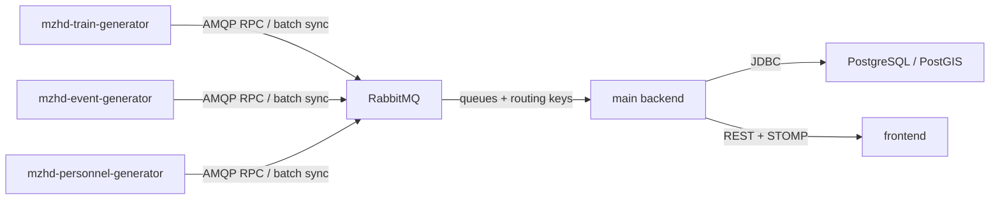

# External Generator Services

The `services/` workspace contains standalone generator microservices that feed realistic operational data into the main dashboard backend through RabbitMQ. The generators do not write to PostgreSQL directly and do not call the public dashboard REST API.

## Services

- `mzhd-train-generator`
  Generates deterministic train positions on the MZhD routes using route topology, time-of-day load factors, and per-line operational profiles.
- `mzhd-event-generator`
  Generates and advances operational events with recovery from backend active-event state after restarts.
- `mzhd-personnel-generator`
  Rebuilds department-level personnel aggregates from the MZhD topology on a periodic schedule.
- `mzhd-generator-common`
  Shared contracts, backend client, topology index, and MZhD operational heuristics.

## Runtime Topology

## Backend Integration

The generators use `GeneratorGatewayClient` and exchange JSON messages through the RabbitMQ direct exchange configured by `generator.messaging.rabbitmq.*`.

Current logical message types:

- `reference-network-request`
- `active-events-request`
- `trains-sync`
- `events-sync`
- `personnel-snapshot-sync`

The backend remains the owner of:

- the approved PostgreSQL/PostGIS schema;
- validation and conflict handling;
- KPI recalculation;
- WebSocket publication to the frontend.

## Runtime Mode

For the external-generator mode, the backend should seed only reference topology and should not run the embedded simulation scheduler:

- `APP_SIMULATION_SCHEDULER_ENABLED=false`
- `APP_SIMULATION_OPERATIONAL_SEED_ENABLED=false`

The default `compose.yaml` is already configured this way.

## Authentication

In local compose mode, generators connect to RabbitMQ with the compose credentials and no separate service token is required. The default Keycloak setup protects the public dashboard API, while generator data exchange continues through RabbitMQ.

In secured environments:

- backend authorization for the fallback internal REST endpoints still uses `ROLE_GENERATOR` or `ROLE_ADMIN`;
- RabbitMQ access is controlled by broker credentials and network policy;
- if the fallback internal REST entry points are enabled, provide `GENERATOR_CLIENT_SERVICE_TOKEN`.
